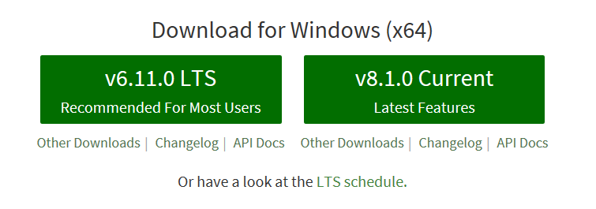
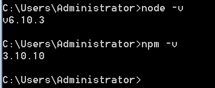
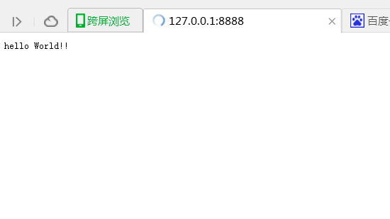

# Hello World!  

**想不想让自己的JS代码运行在Node.js的服务器上呢？？？**   
Node.js这两年来很火哦，我们要不要一起来学习呢？？？虽然有点迟了，但是我们努力学，一定也是会有收获的，你说呢？？ 

## 第一步，安装Node.js  
- 我们可以直接到[Node.js官网]进行下载，Node.js的版本更新得太快了，最好还是到官网下载最新的版本。左边的LTS版本是稳定版本，我们一般使用这个。右边的Current是测试版，有时候也用到，因为我们是初学者，那就用左边的吧！！。  
  
- 安装软件，直接打开安装包，全程下一步就行了，我们也没必要改安装路径了。  
- 测试是否安装成功，运行命令窗口，输入如下指令。 如果结果一样就说明安装成功。 
  
- 在c盘找到node.js的安装路径。创建hello.js文件，如下图：  
    
- hello.js文件里的代码如下：保存好代码。
  ```javascript
  var http = require("http") ; //使用require指令来载入http模块
  http.createServer(function(req,res){
  	/*此行代码说明
	发送Head头部
	HTTP状态值：200：OK
	内容类型：text/plain
	 */
	res.writeHead(200,{'Content-Type':'text/plain'});
	res.end('Hello World\n');
  }).listen(1337,'127.0.0.1');
  console.log('Server running at http://127.0.0.1:1337/');
  ```
- 在hello.js文件的目录下打开命令窗口（因为还没配置环境变量），执行`node hello.js`命令，结果如下图：
  
- 不要关闭命令窗口，在浏览器网站栏输入：http://127.0.0.1:1337/ ，你将看到你的第一个node.js代码的hello world!!

  

## 总结：  
- 我们学会了安装Node.js  
- 我们运行了第一个程序  
- 坚持学下去哦！！
- 我们调用 http 模块提供的函数： createServer 。这个函数会返回 一个对象，这个对象有一个叫做 listen 的方法，这个方法有一个数值参数， 指定这个 HTTP 服务器监听的端口号。

<!--超链接-->
[Node.js官网]: https://nodejs.org/en/
